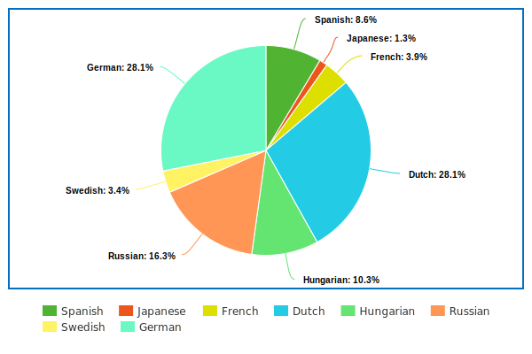
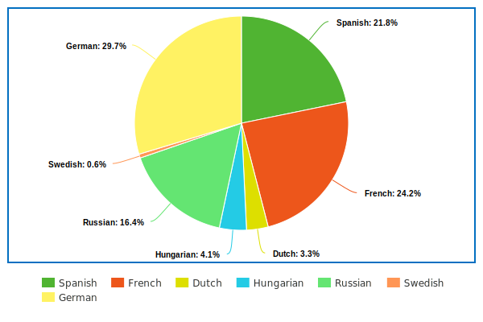

<h1 align="center">YJDict - A Japanese Dictionary</h1>
<p align="center">
    <a href="https://www.rust-lang.org/" alt="Made In">
        </a>
    </a>
    <a href="https://github.com/yxl-prz/YJDict/graphs/contributors" alt="Version">
        </a>
</p>
<p align="center">
<a href="https://github.com/yxl-prz/YJDict/releases/latest/download/yjdict-words.json" alt="Download">
        
    <a href="https://github.com/yxl-prz/YJDict/releases/latest/download/yjdict-sentences.json" alt="Download">
        
</p>

<p align="center">
    
    
</p>

# Structures
## [Rust](#rs-rust) | [Go](#rust--go)
## `.rs`: **Rust**
### Words:
```rs
pub struct Word {
    pub expression: String,
    pub reading: String,
    pub definitions: HashMap<String, Vec<String>>,
    pub pitches: Option<Vec<WordPitch>>,
    pub frequency: Option<u32>,
}

pub struct WordPitch {
    drop: i16,
    notation: Vec<char>,
}
```
### Sentences:
```rs
pub struct Sentence {
    pub sentence: String,
    pub translations: HashMap<String, Vec<String>>,
    pub markdown: Option<String>,
    pub audio: Option<SentenceAudio>,
}

pub struct SentenceAudio {
    pub id: String,
    pub url: String,
    pub user: String,
}
```

## `.go`: **Go**
### Words:
```go
type Word struct {
	Expression  string                `json:"expression"`
	Reading     string                `json:"reading"`
	Definitions map[string]([]string) `json:"definitions"`
	Pitch       *YJDictPitch          `json:"pitches"`
    Frequency:  *u32                  `json:"frequency"`
}

type WordPitch struct {
	Position int8   `json:"position"`
	Notation []byte `json:"notation"`
}
```
### Sentences:
```go
type Sentence struct {
	Sentence     string                `json:"sentence"`
    Translations map[string]([]string) `json:"translations"`
    Markdown     *string               `json:"markdown"`
    Audio        *SentenceAudio        `json:"audio"`
}

type SentenceAudio struct {
    ID   string `json:"id"`
    URL  string `json:"url"`
    User string `json:"user"`
}
```

# Credits
## Words
- ⭐ **JMDict** [[link](https://www.edrdg.org/jmdict/edict_doc.html)]: Majority of the definitions were taken from different variations of the **JMDict** dictionary.
- ⭐ **Kanjium** [[link](https://github.com/mifunetoshiro/kanjium)]: The pitch accent information was taken from **Kanjium**.
- ⭐ **Innocent Corpus** [[link](https://web.archive.org/web/20190309073023/https://forum.koohii.com/thread-9459.html#pid168613)]: The frequency of the expressions were taken from **Innocent Corpus**.
- ⭐ **新明解**: The Japanese definitions were taking from **新明解**.
## Sentences
- ⭐ **Tatoeba** [[link](https://tatoeba.org/en/downloads)]: All of the sentences, audio information, and transcript infomation was taken from **Tatoeba**.
